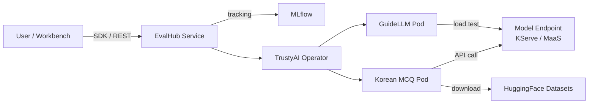

# RHOAI EvalHub Lab

A hands-on workshop for running **Korean language evaluation benchmarks** on **Red Hat OpenShift AI 3.5** using the **EvalHub** service (GA in RHOAI 3.5). This lab guides you through evaluating LLMs — including external MaaS endpoints and cluster-deployed models — on datasets like KMMLU, CLIcK, KoBEST, and HAE-RAE with centralized **MLflow experiment tracking**.

## Architecture




**How it works:**

- **EvalHub** is a lightweight REST API service that orchestrates LLM evaluations across multiple backends (lm-evaluation-harness, GuideLLM, RAGAS, LightEval, and more). It is GA in OpenShift AI 3.5, managed by the TrustyAI Operator.
- **GuideLLM (Phase 1):** Run inference performance benchmarks using [GuideLLM](https://github.com/neuralmagic/guidellm) through EvalHub to measure TTFT, ITL, throughput, and end-to-end latency.
- **Korean MCQ (Phase 2):** Run individual Korean MCQ benchmarks (KMMLU, CLIcK, HAE-RAE, etc.) through the EvalHub SDK with MLflow tracking. Summarize and export results as Markdown/HTML reports.
- **Unified Evaluation (Phase 3):** Run multi-benchmark evaluations and unified accuracy + performance (Korean MCQ + GuideLLM) experiments under a single MLflow experiment, with comparison tables and visualization.

## Model

This workshop supports two model deployment modes:


| Mode                          | Description                                        | Config                                        |
| --- | --- | --- |
| **MaaS (Model-as-a-Service)** | External API endpoint (e.g., cloud-hosted model)   | `MODEL_ENDPOINT` + `MODEL_API_KEY` in `.env`  |
| **KServe (Cluster-deployed)** | InferenceService on OpenShift AI with vLLM runtime | `MODEL_NAME` + `NAMESPACE` → auto-derived URL |


Evaluated models include **GLM-53-Flash** (MaaS), **Gemma 4 12B**, **Qwen3.6-27B-FP8**, **EXAONE 4.0 32B**, and **Qwen3-14B**.

## What's Included

### 0. Setup

- **0_setup/1_LMEval_setup.ipynb**: Configure RBAC permissions, create secrets (HF token, SA token), and verify cluster access for EvalHub evaluation jobs.
- **0_setup/2_eval_hub_setup.ipynb**: Deploy the EvalHub service and MLflow on OpenShift, install the eval-hub-sdk, and verify connectivity.

### 1. GuideLLM Performance Benchmark (Phase 1)

- **1_eval_hub_guidellm_benchmark/1_guidellm_benchmark.ipynb**: Run inference performance benchmarks using GuideLLM through EvalHub SDK. Measures TTFT, ITL, throughput, and end-to-end latency with multiple execution profiles (quick baseline, rate sweep, constant load).

### 2. Korean MCQ Benchmark (Phase 2)

- **2_eval_hub_kmcq_benchmark/1_kmcq_benchmark.ipynb**: Run a single Korean MCQ benchmark (e.g. KMMLU, CLIcK, HAE-RAE) through EvalHub SDK with MLflow tracking. Includes job management and result export.
- **2_eval_hub_kmcq_benchmark/2_summarize_results.ipynb**: Load results from `results/<model>/`, build comparison tables, aggregate by category/supercategory, and export to Markdown and HTML reports.
- **2_eval_hub_kmcq_benchmark/generate_report.py**: Generate a standalone HTML report with interactive Chart.js visualizations and comparison tables.

### 3. Unified Evaluation (Phase 3)

- **3_eval_hub_unified_benchmark/1_unified_benchmark.ipynb**: Run multi-benchmark evaluations, sample size comparisons, and unified accuracy + performance (Korean MCQ + GuideLLM) experiments under a single MLflow experiment. Includes MLflow integration, comparison tables, and result export.

## Korean Benchmark Datasets


| Dataset     | Description                                      | Categories                                      | Samples |
| --- | --- | --- | --- |
| **KMMLU**   | Korean Massive Multi-task Language Understanding | 45 subjects (STEM, HUMSS, Applied Science)      | 35,030  |
| **CLIcK**   | Cultural and Linguistic Intelligence in Korean   | 11 categories (Culture + Language)              | 1,995   |
| **KoBEST**  | Korean Balanced Evaluation of Significant Tasks  | WiC, CoPA, BoolQ, HellaSwag, SentiNeg           | 6,100+  |
| **HAE-RAE** | Korean Language Proficiency Benchmark            | 6 categories (General Knowledge, History, etc.) | 1,538   |


## Evaluation Results

We evaluated **GLM-53-Flash**, **Gemma 4 12B**, **Qwen3.6-27B-FP8**, **EXAONE 4.0 32B**, and **Qwen3-14B** on 5 Korean benchmarks using the custom `korean-mcq` EvalHub adapter with up to 10,000 samples per dataset. Evaluations were orchestrated via EvalHub SDK, with results tracked in MLflow.

**MLflow Tracing** is enabled — each LLM call (prompt/response) is recorded as a structured trace span via `MlflowClient.start_trace()` API, visible in the MLflow UI's Traces tab.


| Benchmark | GLM-53-Flash | Gemma4-12B | Qwen3.6-27B | EXAONE4-32B | Qwen3-14B | Samples |
|:---|---:|---:|---:|---:|---:|---:|
| CLIcK | **94.96%** | 73.88% | 75.90% | 68.30% | 66.82% | 1,995 |
| HAE-RAE Bench 1.1 | **77.01%** | 69.87% | 60.43% | 63.20% | 54.64% | 1,538 |
| KMMLU (0-shot) | **86.48%** | 57.51% | 62.50% | 52.24% | 48.30% | 10,000 |
| KMMLU-HARD (0-shot) | **79.21%** | 33.80% | 43.06% | 29.48% | 27.95% | 10,000 |
| KoBEST BoolQ | **97.77%** | 96.08% | 96.65% | 91.52% | 93.23% | 1,404 |


### Performance (GuideLLM Throughput)


| Metric            | GLM-53-Flash | EXAONE4-32B | Gemma4-12B | Qwen3-14B | Qwen3.6-27B |
| --- | --- | --- | --- | --- | --- |
| Output tokens/sec | 32.54        | 47.74       | 22.86      | 26.65     | 11.40       |
| Prompt tokens/sec | 74.84        | 107.43      | 51.19      | 52.05     | 25.41       |
| Requests/sec      | 1.00         | 0.74        | 0.36       | 0.19      | 0.18        |


Accumulated benchmark results across major open-weight models are maintained at:

> **[evaluate-llm-on-korean-dataset](https://github.com/hyogrin/evaluate-llm-on-korean-dataset)**

This companion repository tracks performance of models like Gemma, Llama, Phi, Qwen, and others on Korean evaluation datasets with detailed per-category breakdowns and radar chart visualizations.

## Prerequisites

- Red Hat OpenShift AI 3.5+ cluster with TrustyAI Operator installed
- EvalHub service and MLflow deployed on the cluster (setup notebook handles this)
- A model endpoint — either:
  - **MaaS:** External API endpoint URL + API key
  - **KServe:** Model deployed via KServe (vLLM runtime)
- `oc` CLI access to the cluster
- Hugging Face API token

## Quick Start

### Option A: Cluster Owner (full setup)

1. Clone this repo into your OpenShift AI Workbench:
  ```bash
   git clone https://github.com/hyogrin/rhoai-evalhub-lab.git
   cd rhoai-evalhub-lab
  ```
2. Open `**0_setup/2_eval_hub_setup.ipynb**` and run **Step 0**:
  - Edit the values in the cell (`NAMESPACE`, `MODEL_NAME`, `MODEL_ENDPOINT`, `MODEL_API_KEY`, `HF_TOKEN`, `HF_MODEL_ID`)
  - Run the cell — it creates `.env` and installs all dependencies
3. Run notebooks in order:
  - `0_setup/1_LMEval_setup.ipynb` — One-time RBAC and secrets setup for EvalHub evaluation jobs
  - `0_setup/2_eval_hub_setup.ipynb` — Deploy EvalHub + MLflow, then run **Step A-7** to generate a shared URL + token for participants
  - `1_eval_hub_guidellm_benchmark/1_guidellm_benchmark.ipynb` — Inference performance profiling (TTFT, ITL, throughput)
  - `2_eval_hub_kmcq_benchmark/1_kmcq_benchmark.ipynb` — Single Korean MCQ benchmark evaluation
  - `2_eval_hub_kmcq_benchmark/2_summarize_results.ipynb` — Analyze results and generate Markdown/HTML reports
  - `3_eval_hub_unified_benchmark/1_unified_benchmark.ipynb` — Multi-benchmark + unified accuracy/performance evaluation

### Option B: Workshop Participant (shared cluster)

No cluster setup required — the cluster owner provides you with the connection info.

1. Clone this repo (Workbench, laptop, or any Jupyter environment):
  ```bash
   git clone https://github.com/hyogrin/rhoai-evalhub-lab.git
   cd rhoai-evalhub-lab
  ```
2. Open `**0_setup/2_eval_hub_setup.ipynb**` and run **Step 0**:
  - Paste the values from the cluster owner: `NAMESPACE`, `MODEL_NAME`, `MODEL_ENDPOINT`, `MODEL_API_KEY`, `EVALHUB_URL`, `EVALHUB_AUTH_TOKEN`
  - Run the cell — it creates `.env` and installs dependencies
3. **Skip** `1_LMEval_setup` and Part A of `2_eval_hub_setup` — go directly to Phase 1-3 notebooks

> **Local development:** If you have [uv](https://docs.astral.sh/uv/) installed, you can use `uv sync` instead for a reproducible virtual environment.

## Phase Comparison


|                         | Phase 1: GuideLLM              | Phase 2: Korean MCQ         | Phase 3: Unified                   |
| --- | --- | --- | --- |
| **Approach**            | GuideLLM via EvalHub SDK       | Single Korean MCQ benchmark | Multi-benchmark + GuideLLM unified |
| **What it measures**    | TTFT, ITL, throughput, latency | Accuracy per benchmark      | Accuracy + performance combined    |
| **Scope**               | Performance only               | One benchmark at a time     | All benchmarks + performance       |
| **Experiment Tracking** | Built-in MLflow                | Built-in MLflow             | Unified MLflow experiment          |
| **Best For**            | Capacity planning              | Quick single-task eval      | Production comprehensive eval      |


## Detailed Evaluation Results

### CLIcK — Accuracy by supercategory


| supercategory | glm-53-flash | gemma4-12b | qwen36-27b | exaone4-32b | qwen3-14b |
| --- | --- | --- | --- | --- | --- |
| Culture | 93.89 | 73.80 | 74.78 | 69.43 | 65.65 |
| Language | 97.88 | 73.56 | 78.38 | 65.79 | 69.44 |


### CLIcK — Accuracy by category


| category | glm-53-flash | gemma4-12b | qwen36-27b | exaone4-32b | qwen3-14b |
| --- | --- | --- | --- | --- | --- |
| Economy | 94.83 | 91.53 | 91.53 | 89.83 | 81.36 |
| Functional | 98.11 | 85.71 | 89.52 | 70.71 | 82.35 |
| Geography | 98.21 | 80.33 | 77.78 | 78.23 | 71.20 |
| Grammar | 97.20 | 51.07 | 56.90 | 43.29 | 45.18 |
| History | 85.62 | 49.29 | 48.57 | 44.64 | 40.71 |
| Law | 95.74 | 64.84 | 65.75 | 58.45 | 56.16 |
| Politics | 93.75 | 79.76 | 85.71 | 79.76 | 77.38 |
| Pop Culture | 100.00 | 87.80 | 87.80 | 82.93 | 78.05 |
| Society | 96.59 | 86.41 | 89.97 | 81.23 | 80.91 |
| Textual | 98.16 | 88.19 | 92.57 | 82.91 | 84.93 |
| Tradition | 91.39 | 82.88 | 82.88 | 78.38 | 71.17 |


### HAE-RAE — Accuracy by category


| category | glm-53-flash | gemma4-12b | qwen36-27b | exaone4-32b | qwen3-14b |
| --- | --- | --- | --- | --- | --- |
| correct_definition_matching | 97.89 | 85.29 | 86.33 | 78.54 | 83.96 |
| csat_geo | 100.00 | 65.15 | 65.33 | 66.67 | 16.67 |
| csat_law | - | 52.70 | 49.07 | 35.00 | 40.68 |
| csat_socio | 87.50 | 49.23 | 46.64 | 37.74 | 36.00 |
| date_understanding | 21.88 | 56.06 | 51.37 | - | - |
| general_knowledge | 90.85 | 60.23 | 58.52 | 54.86 | 50.29 |
| history | 96.76 | 83.96 | 81.91 | 89.19 | 58.51 |
| loan_words | 90.21 | 72.89 | 67.46 | 77.27 | 92.00 |
| lyrics_denoising | 0.00 | 0.00 | 0.00 | 0.00 | - |
| rare_words | 87.61 | 81.56 | 81.73 | 83.29 | - |
| reading_comprehension | 97.94 | 81.51 | 84.08 | 72.00 | - |
| standard_nomenclature | 94.40 | 75.33 | 79.08 | 75.21 | - |


### KMMLU — Accuracy by supercategory


| supercategory | glm-53-flash | gemma4-12b | qwen36-27b | exaone4-32b | qwen3-14b |
| --- | --- | --- | --- | --- | --- |
| HUMSS | 94.77 | 72.73 | 80.00 | 67.58 | 50.00 |
| STEM | 86.68 | 57.46 | 65.27 | 51.92 | - |
| Other | 86.01 | 57.00 | 60.66 | 51.64 | 48.21 |


### KMMLU — Accuracy by category (partial)


| category | glm-53-flash | gemma4-12b | qwen36-27b | exaone4-32b | qwen3-14b |
| --- | --- | --- | --- | --- | --- |
| Accounting | 95.12 | 67.00 | 69.00 | 61.00 | 50.00 |
| Agricultural Sciences | 81.44 | 49.90 | 51.70 | 41.90 | 42.70 |
| Aviation Engineering and Maintenance | 91.06 | 58.80 | 68.20 | 56.30 | 54.33 |
| Biology | 87.13 | 48.80 | 60.80 | 46.20 | - |
| Chemical Engineering | 93.67 | 60.20 | 69.70 | 57.00 | - |
| Chemistry | 96.16 | 65.50 | 77.33 | 57.67 | - |
| Civil Engineering | 85.75 | 55.60 | 55.00 | 45.40 | - |
| Computer Science | 95.50 | 80.90 | 87.50 | 81.00 | - |
| Construction | 76.31 | 49.80 | 47.40 | 41.00 | - |
| Criminal Law | 82.02 | 48.00 | 51.00 | 44.00 | - |
| Ecology | 80.22 | 61.30 | 62.50 | 54.20 | - |
| Economics | 93.69 | 73.85 | 83.08 | 63.85 | - |
| Education | 95.74 | 77.00 | 87.00 | 79.00 | - |
| Electrical Engineering | 74.58 | 43.84 | 45.06 | 38.74 | - |


### KMMLU-HARD — Accuracy by supercategory


| supercategory | glm-53-flash | gemma4-12b | qwen36-27b | exaone4-32b | qwen3-14b |
| --- | --- | --- | --- | --- | --- |
| Other | 79.21 | 33.83 | 43.06 | 29.48 | 27.95 |


> EXAONE4-32B and later models evaluated with limit=10,000 (covers all 45 KMMLU-HARD categories).

### KMMLU-HARD — Accuracy by category


| category | glm-53-flash | gemma4-12b | qwen36-27b | exaone4-32b | qwen3-14b |
| --- | --- | --- | --- | --- | --- |
| accounting | 91.43 | 54.35 | 54.35 | 36.96 | 23.91 |
| agricultural_sciences | 66.67 | 30.00 | 35.00 | 19.00 | - |
| aviation_engineering | 83.67 | 31.00 | 52.00 | 35.00 | - |
| biology | 87.04 | 27.00 | 36.00 | 30.00 | 23.00 |
| chemical_engineering | 90.43 | 29.00 | 50.00 | 31.00 | - |
| chemistry | 95.29 | 47.00 | 64.00 | 31.00 | 39.00 |
| civil_engineering | 78.05 | 30.00 | 41.00 | 27.00 | - |
| computer_science | 83.95 | 39.00 | 51.00 | 32.00 | 36.00 |
| construction | 67.07 | 27.00 | 26.00 | 28.00 | - |
| criminal_law | 71.43 | 34.00 | 35.00 | 23.00 | 28.00 |
| ecology | 66.67 | 27.00 | 35.00 | 26.00 | 23.00 |
| economics | 81.82 | 47.62 | 64.29 | 35.71 | - |
| education | 80.00 | 43.48 | 60.87 | 52.17 | - |
| electrical_engineering | 75.00 | 28.00 | 33.00 | 32.00 | 19.00 |
| electronics_engineering | 94.05 | 43.00 | 59.00 | 32.00 | 43.00 |
| energy_management | 77.78 | 36.00 | 47.00 | 33.00 | - |
| environmental_science | 77.11 | 24.00 | 30.00 | 25.00 | - |
| fashion | 52.27 | 27.00 | 36.00 | 25.00 | - |
| food_processing | 68.13 | 26.00 | 41.00 | 18.00 | - |
| gas_technology_and_engineering | 77.38 | 27.00 | 41.00 | 20.00 | 24.00 |
| geomatics | 81.01 | 40.00 | 30.00 | 29.00 | 25.00 |
| health | 84.62 | 47.83 | 39.13 | 43.48 | 13.04 |
| industrial_engineer | 66.27 | 32.00 | 34.00 | 23.00 | - |
| information_technology | 91.57 | 37.00 | 50.00 | 36.00 | 37.00 |
| interior_architecture | 78.31 | 32.00 | 46.00 | 31.00 | - |
| korean_history | 81.25 | 25.58 | 25.00 | 20.45 | 18.18 |
| law | 63.64 | 40.00 | 41.00 | 32.00 | - |
| machine_design_and_manufacturing | 84.78 | 33.00 | 48.00 | 31.00 | 26.09 |
| management | 85.51 | 46.00 | 56.00 | 34.00 | 35.00 |
| maritime_engineering | 87.50 | 25.00 | 46.00 | 24.00 | 29.00 |
| marketing | 70.65 | 47.00 | 53.00 | 42.00 | - |
| materials_engineering | 91.78 | 33.00 | 56.00 | 35.00 | 27.00 |
| math | 98.81 | 25.00 | 35.00 | 29.00 | 20.00 |
| mechanical_engineering | 85.42 | 29.00 | 43.00 | 29.00 | - |
| nondestructive_testing | 72.22 | 31.00 | 47.00 | 37.00 | 27.00 |
| patent | 50.00 | 45.10 | 41.18 | 19.61 | 35.29 |
| political_science_and_sociology | 85.00 | 36.67 | 48.89 | 31.11 | 24.44 |
| psychology | 77.78 | 34.00 | 44.00 | 29.00 | - |
| public_safety | 72.06 | 25.00 | 33.00 | 23.00 | 21.00 |
| railway_and_automotive_engineering | 83.53 | 26.00 | 30.00 | 21.00 | 29.00 |
| real_estate | 63.27 | 42.70 | 32.58 | 35.96 | - |
| refrigerating_machinery | 89.25 | 36.00 | 44.00 | 34.00 | - |
| social_welfare | 82.29 | 47.00 | 56.00 | 33.00 | - |
| taxation | 51.43 | 26.04 | 27.08 | 25.00 | - |
| telecommunications | 77.08 | 42.00 | 57.00 | 34.00 | - |


### KoBEST BoolQ


| category | glm-53-flash | gemma4-12b | qwen36-27b | exaone4-32b | qwen3-14b |
| --- | --- | --- | --- | --- | --- |
| overall | 97.77 | 96.08 | 96.65 | 91.52 | 93.23 |


## About

This workshop was built through real debugging and iteration on OpenShift AI. Key learnings documented:

- EvalHub (GA in RHOAI 3.5) orchestrates evaluations via REST API with built-in MLflow tracking
- The `korean-mcq` custom adapter evaluates Korean benchmarks with per-question accuracy
- Both MaaS endpoints (external API) and KServe InferenceServices (cluster-internal) are supported
- OAuth-protected InferenceServices require RBAC + SA token via `OPENAI_API_KEY` env var
- SSL verification must be disabled for self-signed certs (`verify_certificate: "False"`)

