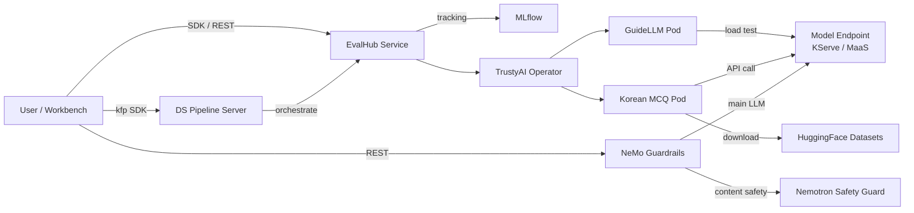
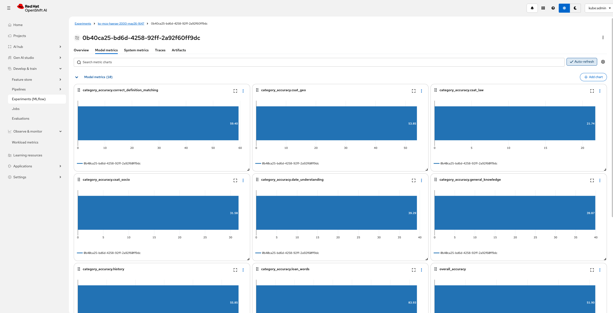
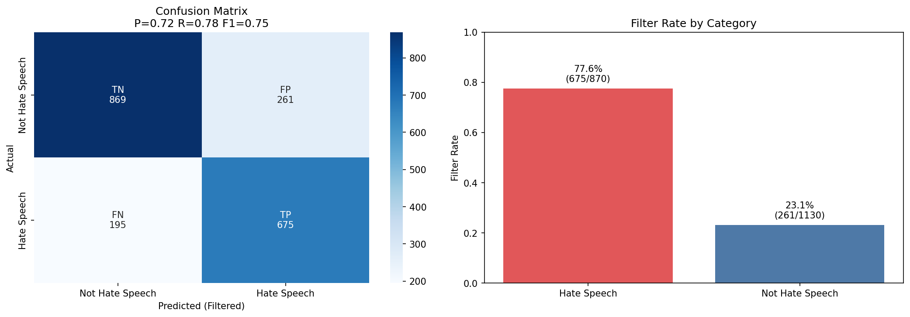

# RHOAI EvalHub Lab

A hands-on workshop for running **Korean language evaluation benchmarks** and **AI safety guardrails evaluation** on **Red Hat OpenShift AI 3.5** using the **EvalHub** service (GA in RHOAI 3.5). This lab guides you through evaluating LLMs — including external MaaS endpoints and cluster-deployed models — on datasets like KMMLU, CLIcK, KoBEST, and HAE-RAE with centralized **MLflow experiment tracking**, automated **Data Science Pipelines**, and **NeMo Guardrails** content safety evaluation on Korean hate speech.

## Architecture


```mermaid
flowchart LR
    User[User / Workbench] -->|SDK / REST| EvalHub[EvalHub Service]
    EvalHub -->|tracking| MLflow[MLflow]
    EvalHub --> Operator[TrustyAI Operator]
    Operator --> GuideLLM[GuideLLM Pod]
    Operator --> MCQ[Korean MCQ Pod]
    GuideLLM -->|load test| Model[Model Endpoint<br/>KServe / MaaS]
    MCQ -->|API call| Model
    MCQ -->|download| HF[HuggingFace Datasets]
    User -->|kfp SDK| Pipeline[DS Pipeline Server]
    Pipeline -->|orchestrate| EvalHub
    User -->|REST| Guardrails[NeMo Guardrails]
    Guardrails -->|content safety| SafetyModel[Nemotron Safety Guard]
    Guardrails -->|main LLM| Model
```


**How it works:**

- **EvalHub** is a lightweight REST API service that orchestrates LLM evaluations across multiple backends (lm-evaluation-harness, GuideLLM, RAGAS, LightEval, and more). It is GA in OpenShift AI 3.5, managed by the TrustyAI Operator.
- **GuideLLM (Phase 1):** Run inference performance benchmarks using [GuideLLM](https://github.com/neuralmagic/guidellm) through EvalHub to measure TTFT, ITL, throughput, and end-to-end latency.
- **Korean MCQ (Phase 2):** Run individual Korean MCQ benchmarks (KMMLU, CLIcK, HAE-RAE, etc.) through the EvalHub SDK with MLflow tracking. Summarize and export results as Markdown/HTML reports.
- **Unified Evaluation (Phase 3):** Run multi-benchmark evaluations and unified accuracy + performance (Korean MCQ + GuideLLM) experiments under a single MLflow experiment, with comparison tables and visualization.
- **Pipeline (Phase 4):** Automate the entire evaluation workflow as a Kubeflow Pipeline (KFP v2) on OpenShift AI Data Science Pipelines — accuracy, performance, reporting, and Slack notification in a single run.
- **Guardrails Evaluation (Phase 5):** Deploy and evaluate NeMo Guardrails with content safety models on Korean hate speech using the [K-MHaS](https://huggingface.co/datasets/nayohan/K-MHaS) dataset.

## Model

This workshop supports two model deployment modes:


| Mode                          | Description                                        | Config                                        |
| ----------------------------- | -------------------------------------------------- | --------------------------------------------- |
| **MaaS (Model-as-a-Service)** | External API endpoint (e.g., cloud-hosted model)   | `MODEL_ENDPOINT` + `MODEL_API_KEY` in `.env`  |
| **KServe (Cluster-deployed)** | InferenceService on OpenShift AI with vLLM runtime | `MODEL_NAME` + `NAMESPACE` → auto-derived URL |


Evaluated models include **GLM-53-Flash** (MaaS), **Gemma 4 12B**, **Qwen3.6-27B-FP8**, **EXAONE 4.0 32B**, and **Qwen3-14B**.

## What's Included

### 0. Setup

- **0_setup/1_LMEval_setup.ipynb**: Configure RBAC permissions, create secrets (HF token, SA token), and verify cluster access for EvalHub evaluation jobs.
- **0_setup/2_eval_hub_setup.ipynb**: Deploy the EvalHub service and MLflow on OpenShift, install the eval-hub-sdk, and verify connectivity.

### 1. GuideLLM Performance Benchmark (Phase 1)

- **1_eval_hub_guidellm_benchmark/1_guidellm_benchmark.ipynb**: Run inference performance benchmarks using GuideLLM through EvalHub SDK. Measures TTFT, ITL, throughput, and end-to-end latency with multiple execution profiles (quick baseline, rate sweep, constant load).

### 2. Korean MCQ Benchmark (Phase 2)

- **2_eval_hub_kmcq_benchmark/1_kmcq_benchmark.ipynb**: Run a single Korean MCQ benchmark (e.g. KMMLU, CLIcK, HAE-RAE) through EvalHub SDK with MLflow tracking. Includes job management and result export.
- **2_eval_hub_kmcq_benchmark/2_summarize_results.ipynb**: Load results from `results/<model>/`, build comparison tables, aggregate by category/supercategory, and export to Markdown and HTML reports.
- **2_eval_hub_kmcq_benchmark/generate_report.py**: Generate a standalone HTML report with interactive Chart.js visualizations and comparison tables.

### 3. Unified Evaluation (Phase 3)

- **3_eval_hub_unified_benchmark/1_unified_benchmark.ipynb**: Run multi-benchmark evaluations, sample size comparisons, and unified accuracy + performance (Korean MCQ + GuideLLM) experiments under a single MLflow experiment. Includes MLflow integration, comparison tables, and result export.

### 4. Evaluation Pipeline (Phase 4)

- **4_eval_pipeline/1_run_pipeline.ipynb**: Compile and submit the end-to-end evaluation pipeline to Data Science Pipelines (KFP v2). Runs 5 Korean benchmarks + GuideLLM throughput in a single pipeline run, generates HTML/Markdown reports, and sends Slack notifications.
- **4_eval_pipeline/pipeline.py**: Pipeline definition — accuracy, performance, report generation, and notification steps.
- **4_eval_pipeline/compile.py**: Compile the pipeline to `eval_pipeline.yaml` for submission.

### 5. Guardrails Evaluation (Phase 5)

- **5_eval_guardrail/1_guardrail_setup.ipynb**: (Admin) Deploy NeMo Guardrails with two configurations — `guardrail-regex-only` (regex patterns) and `guardrail-content-safety` (regex + Nemotron Safety Guard 8B). Demonstrates progressive content safety: regex alone fails on Korean hate speech, while the content safety model blocks it.
- **5_eval_guardrail/2_guardrail_test.ipynb**: (User) Interactive testing of guardrail configurations. Send Korean text through both configs side-by-side to compare regex-only vs content-safety filtering behavior.
- **5_eval_guardrail/3_evaluate_guardrail.ipynb**: (User) Run a systematic evaluation of the content safety guardrail on the [K-MHaS](https://huggingface.co/datasets/nayohan/K-MHaS) Korean hate speech dataset. Computes precision, recall, F1, confusion matrix, per-category breakdown, and generates a self-contained HTML report with LLM-generated recommendations.

## Korean Benchmark Datasets


| Dataset                                                                     | Description                                      | Categories                                      | Samples |
| --------------------------------------------------------------------------- | ------------------------------------------------ | ----------------------------------------------- | ------- |
| **[KMMLU](https://huggingface.co/datasets/HAERAE-HUB/KMMLU)**               | Korean Massive Multi-task Language Understanding | 45 subjects (STEM, HUMSS, Applied Science)      | 35,030  |
| **[CLIcK](https://huggingface.co/datasets/EunsuKim/CLIcK)**                 | Cultural and Linguistic Intelligence in Korean   | 11 categories (Culture + Language)              | 1,995   |
| **[KoBEST](https://huggingface.co/datasets/skt/kobest_v1)**                 | Korean Balanced Evaluation of Significant Tasks  | WiC, CoPA, BoolQ, HellaSwag, SentiNeg           | 6,100+  |
| **[HAE-RAE](https://huggingface.co/datasets/HAERAE-HUB/HAE_RAE_BENCH_1.1)** | Korean Language Proficiency Benchmark            | 6 categories (General Knowledge, History, etc.) | 1,538   |


## Reports


| Report                                                                                                      | Description                                                                                                               |
| ----------------------------------------------------------------------------------------------------------- | ------------------------------------------------------------------------------------------------------------------------- |
| [Korean LLM Benchmark Report](./results/report.html)                                                        | Multi-model accuracy comparison across 5 Korean benchmarks with interactive Chart.js visualizations                       |
| [Guardrail Evaluation Report](./results/guardrail/guardrail_eval_guardrail-content-safety_2000_report.html) | Content safety evaluation on K-MHaS (2,000 samples) — confusion matrix, category breakdown, LLM-generated recommendations |


## Evaluation Results

### Korean MCQ Benchmark Results

We evaluated **GLM-53-Flash**, **Gemma 4 12B**, **Qwen3.6-27B-FP8**, **EXAONE 4.0 32B**, and **Qwen3-14B** on 5 Korean benchmarks using the custom `korean-mcq` EvalHub adapter with up to 10,000 samples per dataset. Evaluations were orchestrated via EvalHub SDK, with results tracked in MLflow.

**MLflow Tracing** is enabled — each LLM call (prompt/response) is recorded as a structured trace span via `MlflowClient.start_trace()` API, visible in the MLflow UI's Traces tab.




| Benchmark           | GLM-53-Flash | Gemma4-12B | Qwen3.6-27B | EXAONE4-32B | Qwen3-14B | Samples |
| ------------------- | ------------ | ---------- | ----------- | ----------- | --------- | ------- |
| CLIcK               | **94.96%**   | 73.88%     | 75.90%      | 68.30%      | 66.82%    | 1,995   |
| HAE-RAE Bench 1.1   | **77.01%**   | 69.87%     | 60.43%      | 63.20%      | 54.64%    | 1,538   |
| KMMLU (0-shot)      | **86.48%**   | 57.51%     | 62.50%      | 52.24%      | 48.30%    | 10,000  |
| KMMLU-HARD (0-shot) | **79.21%**   | 33.80%     | 43.06%      | 29.48%      | 27.95%    | 10,000  |
| KoBEST BoolQ        | **97.77%**   | 96.08%     | 96.65%      | 91.52%      | 93.23%    | 1,404   |


### Performance (GuideLLM Throughput)


| Metric            | GLM-53-Flash | EXAONE4-32B | Gemma4-12B | Qwen3-14B | Qwen3.6-27B |
| ----------------- | ------------ | ----------- | ---------- | --------- | ----------- |
| Output tokens/sec | 32.54        | 47.74       | 22.86      | 26.65     | 11.40       |
| Prompt tokens/sec | 74.84        | 107.43      | 51.19      | 52.05     | 25.41       |
| Requests/sec      | 1.00         | 0.74        | 0.36       | 0.19      | 0.18        |


> 📄 **Full report:** [Korean LLM Benchmark Report](./results/report.html) — interactive Chart.js visualizations with per-category accuracy comparisons across all models.

### Guardrail Content Safety Evaluation Results

We evaluated the **NeMo Guardrails + Llama 3.1 Nemotron Safety Guard 8B** content safety pipeline on Korean hate speech detection using the [K-MHaS](https://huggingface.co/datasets/nayohan/K-MHaS) (Korean Multi-label Hate Speech) dataset from COLING 2022. The evaluation used **2,000 samples** from the validation split with binary classification (Hate Speech vs Not Hate Speech).

**Setup:**

- **Safety Model:** [Llama 3.1 Nemotron Safety Guard 8B](https://huggingface.co/nvidia/llama-3.1-nemoguard-8b-content-safety) — deployed via KServe (vLLM runtime, 1× GPU)
- **Guardrail Config:** `guardrail-content-safety` — regex patterns + content safety model with S1–S13 unsafe content categories
- **Platform:** NeMo Guardrails Orchestrator on OpenShift AI
- **Dataset:** K-MHaS — 109,692 utterances total, 8 hate categories (Age, Gender, Race, Religion, Disability, Profanity, Sexual, Not Hate Speech)

**Overall Metrics (2,000 samples):**


| Metric              | Value                                     |
| ------------------- | ----------------------------------------- |
| Precision           | 0.721                                     |
| Recall              | 0.776                                     |
| F1-Score            | 0.748                                     |
| Accuracy            | 0.772                                     |
| False Positive Rate | 0.231 (safe messages incorrectly blocked) |
| False Negative Rate | 0.224 (hate speech missed)                |


**Confusion Matrix:**


|                             | Predicted: Allowed | Predicted: Blocked |
| --------------------------- | ------------------ | ------------------ |
| **Actual: Not Hate Speech** | TN = 776           | FP = 234           |
| **Actual: Hate Speech**     | FN = 195           | TP = 679           |




**Key Findings:**

- The content safety model achieves **77.2% accuracy** on Korean hate speech detection — a meaningful baseline for multilingual safety.
- **FPR of 23.1%** indicates over-blocking: ~1 in 4 safe Korean messages is incorrectly filtered. This is a known challenge with safety models optimized for English.
- **FNR of 22.4%** means ~1 in 5 hate speech samples passes through undetected, particularly in categories with implicit or culturally-specific expressions.
- Regex-only configuration (`guardrail-regex-only`) **cannot detect Korean hate speech at all** — it only matches English patterns and structured data (SSN, credit cards, etc.). The content safety model is essential for multilingual coverage.

> 📄 **Full report:** [guardrail_eval_guardrail-content-safety_2000_report.html](./results/guardrail/guardrail_eval_guardrail-content-safety_2000_report.html) — includes per-category breakdown and LLM-generated recommendations.

## Prerequisites

- Red Hat OpenShift AI 3.5+ cluster with TrustyAI Operator installed
- EvalHub service and MLflow deployed on the cluster (setup notebook handles this)
- A model endpoint — either:
  - **MaaS:** External API endpoint URL + API key
  - **KServe:** Model deployed via KServe (vLLM runtime)
- `oc` CLI access to the cluster
- Hugging Face API token

## Quick Start

### Option A: Cluster Owner (full setup)

1. Clone this repo into your OpenShift AI Workbench:
  ```bash
   git clone https://github.com/hyogrin/rhoai-evalhub-lab.git
   cd rhoai-evalhub-lab
  ```
2. Open `**0_setup/2_eval_hub_setup.ipynb**` and run **Step 0**:
  - Edit the values in the cell (`NAMESPACE`, `MODEL_NAME`, `MODEL_ENDPOINT`, `MODEL_API_KEY`, `HF_TOKEN`, `HF_MODEL_ID`)
  - Run the cell — it creates `.env` and installs all dependencies
3. Run notebooks in order:
  - `0_setup/1_LMEval_setup.ipynb` — One-time RBAC and secrets setup for EvalHub evaluation jobs
  - `0_setup/2_eval_hub_setup.ipynb` — Deploy EvalHub + MLflow, then run **Step A-7** to generate a shared URL + token for participants
  - `1_eval_hub_guidellm_benchmark/1_guidellm_benchmark.ipynb` — Inference performance profiling (TTFT, ITL, throughput)
  - `2_eval_hub_kmcq_benchmark/1_kmcq_benchmark.ipynb` — Single Korean MCQ benchmark evaluation
  - `2_eval_hub_kmcq_benchmark/2_summarize_results.ipynb` — Analyze results and generate Markdown/HTML reports
  - `3_eval_hub_unified_benchmark/1_unified_benchmark.ipynb` — Multi-benchmark + unified accuracy/performance evaluation
  - `4_eval_pipeline/1_run_pipeline.ipynb` — Automated pipeline evaluation (requires DS Pipelines)
  - `5_eval_guardrail/1_guardrail_setup.ipynb` — Deploy NeMo Guardrails with content safety model
  - `5_eval_guardrail/2_guardrail_test.ipynb` — Test guardrail configurations interactively
  - `5_eval_guardrail/3_evaluate_guardrail.ipynb` — Evaluate guardrails on K-MHaS Korean hate speech dataset

### Option B: Workshop Participant (shared cluster)

No cluster setup required — the cluster owner provides you with the connection info.

1. Clone this repo (Workbench, laptop, or any Jupyter environment):
  ```bash
   git clone https://github.com/hyogrin/rhoai-evalhub-lab.git
   cd rhoai-evalhub-lab
  ```
2. Open `**0_setup/2_eval_hub_setup.ipynb**` and run **Step 0**:
  - Paste the values from the cluster owner: `NAMESPACE`, `MODEL_NAME`, `MODEL_ENDPOINT`, `MODEL_API_KEY`, `EVALHUB_URL`, `EVALHUB_AUTH_TOKEN`
  - Run the cell — it creates `.env` and installs dependencies
3. **Skip** `1_LMEval_setup` and Part A of `2_eval_hub_setup` — go directly to Phase 1-3 notebooks

> **Local development:** If you have [uv](https://docs.astral.sh/uv/) installed, you can use `uv sync` instead for a reproducible virtual environment.

## Phase Comparison


|                         | Phase 1: GuideLLM              | Phase 2: Korean MCQ         | Phase 3: Unified                   | Phase 4: Pipeline               | Phase 5: Guardrails            |
| ----------------------- | ------------------------------ | --------------------------- | ---------------------------------- | ------------------------------- | ------------------------------ |
| **Approach**            | GuideLLM via EvalHub SDK       | Single Korean MCQ benchmark | Multi-benchmark + GuideLLM unified | KFP v2 pipeline on DS Pipelines | NeMo Guardrails + Safety Model |
| **What it measures**    | TTFT, ITL, throughput, latency | Accuracy per benchmark      | Accuracy + performance combined    | End-to-end automated evaluation | Content safety filter accuracy |
| **Scope**               | Performance only               | One benchmark at a time     | All benchmarks + performance       | All phases automated            | Korean hate speech detection   |
| **Experiment Tracking** | Built-in MLflow                | Built-in MLflow             | Unified MLflow experiment          | Pipeline run + MLflow           | CSV + HTML report              |
| **Best For**            | Capacity planning              | Quick single-task eval      | Production comprehensive eval      | CI/CD and scheduled evaluations | Safety compliance validation   |


## About

This workshop was built through real debugging and iteration on OpenShift AI. Key learnings documented:

- EvalHub (GA in RHOAI 3.5) orchestrates evaluations via REST API with built-in MLflow tracking
- The `korean-mcq` custom adapter evaluates Korean benchmarks with per-question accuracy
- Both MaaS endpoints (external API) and KServe InferenceServices (cluster-internal) are supported
- OAuth-protected InferenceServices require RBAC + SA token via `OPENAI_API_KEY` env var
- SSL verification must be disabled for self-signed certs (`verify_certificate: "False"`)
- NeMo Guardrails supports multi-config deployment — `config_id` must be nested inside the `guardrails` object in the request body
- Reasoning models (e.g., GLM-53-Flash) consume `max_tokens` for internal thinking before generating content — set a sufficiently large `max_tokens` when using them for text generation

## References

- **[evaluate-llm-on-korean-dataset](https://github.com/hyogrin/evaluate-llm-on-korean-dataset)** — Accumulated Korean LLM benchmark results across major open-weight models (Gemma, Llama, Phi, Qwen, etc.) with per-category breakdowns and radar chart visualizations.
- **[evaluate-contentfilter-on-korean-dataset](https://github.com/hyogrin/evaluate-contentfilter-on-korean-dataset)** — Reference implementation for evaluating content safety filters on the K-MHaS Korean hate speech dataset.

